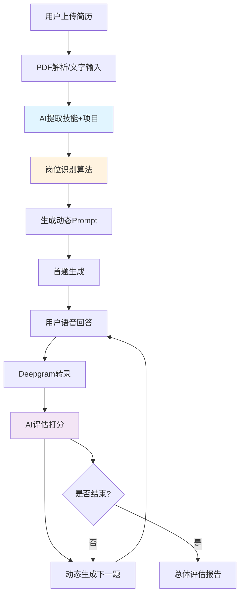
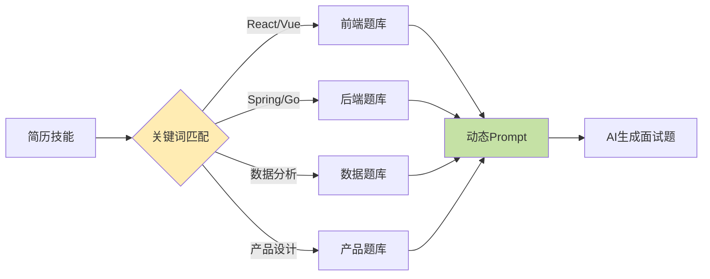
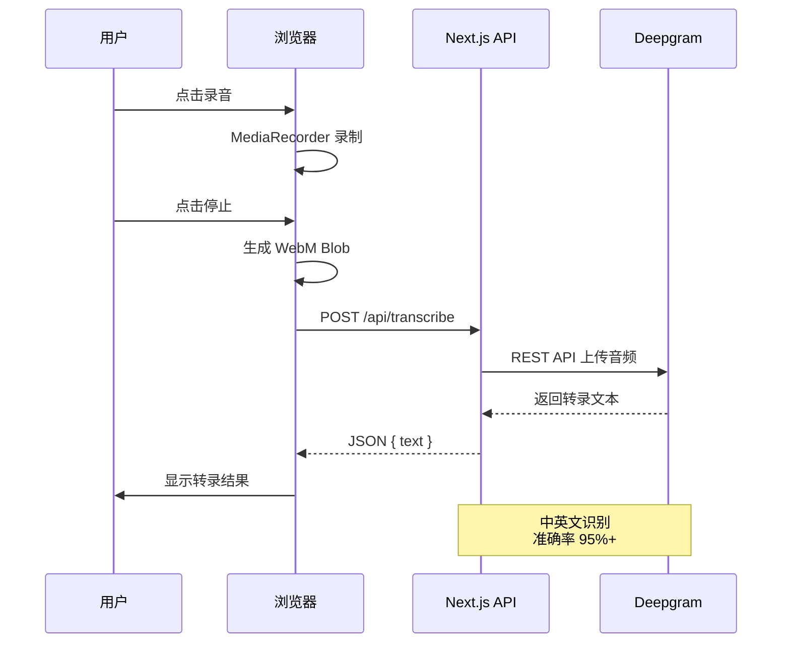
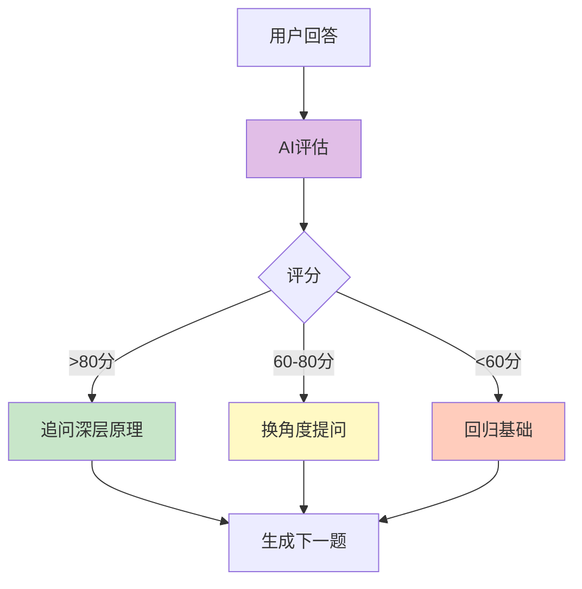
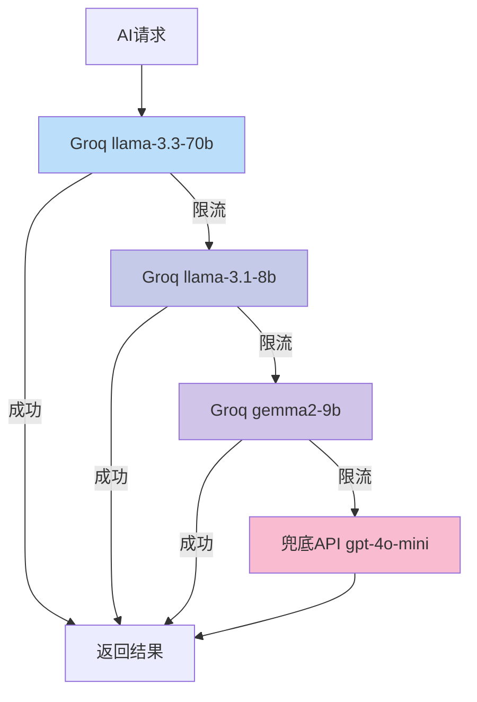
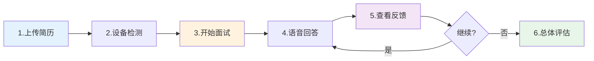

<div align="center">

# 🎯 QuizPort - AI 模拟面试平台

**用 AI 模拟真实面试，语音实时对话，即时反馈优化**

基于简历智能生成面试题 | 语音实时转录 | 动态难度调整 | 多模型容灾

<br />

[在线体验](https://quizport.vercel.app) · [功能演示](#-功能演示) · [技术架构](#-技术架构)

</div>

---

## 📖 项目简介

QuizPort 是一个 AI 驱动的模拟面试平台，帮助求职者通过语音对话进行真实面试练习。

### 核心功能

- 📄 **智能简历解析**：上传 PDF 或输入文字，AI 自动提取技能、项目经验
- 🎭 **动态面试官**：根据简历识别岗位（前端/后端/产品/运营），生成专业面试题
- 🎤 **语音实时转录**：边说边显示，支持中英文
- 🤖 **AI 即时评估**：每题结束立即给出评分、优缺点分析
- 🔄 **智能追问**：根据回答质量动态调整难度
- 🛡️ **多模型容灾**：Groq限流时自动切换兜底API

---

## 🎬 功能演示

### 1. 简历上传与解析

```
上传 PDF 简历 → AI 提取信息 → 生成面试计划
```

**解析内容：**
- 基本信息（姓名、联系方式、工作年限）
- 技能清单（编程语言、框架、工具）
- 项目经历（项目名称、技术栈、描述）
- 岗位识别（前端/后端/产品/运营/数据/算法）

### 2. 面试进行中

```
显示题目 → 语音回答 → 实时转录 → AI 评估 → 生成下一题
```

**交互流程：**
1. 点击中央按钮开始录音
2. 边说话边显示转录文字
3. 再次点击结束录音
4. 2-5秒后显示评分和反馈面板
5. 自动生成下一题

### 3. 反馈面板

```
┌─────────────────────┐
│ 💬 你的回答          │
│ 我有三段工作经历...  │
├─────────────────────┤
│      85 分          │
├─────────────────────┤
│ ✓ 优点：经历丰富     │
│ ⚠ 需加强：技术细节   │
└─────────────────────┘
```

---

## 🏗️ 技术架构

### 系统流程



### 技术栈

| 分类 | 技术 | 用途 |
|------|------|------|
| **框架** | Next.js 15 + React 18 | App Router、SSR |
| **样式** | Tailwind CSS 4 | 原子化 CSS |
| **动画** | Framer Motion | 流畅交互动画 |
| **语音** | Deepgram API | 实时语音转文字 |
| **AI** | Groq + OpenAI 兼容 | 低延迟推理 + 容灾 |
| **PDF** | pdf-parse | 简历解析 |
| **UI** | Lucide Icons | 图标库 |

---

## 🔑 核心技术实现

### 1️⃣ 动态面试官 Prompt 生成



**关键实现：**

```typescript
// 岗位识别算法
function analyzeRoleAndGenerateContext(resumeAnalysis: any) {
  const skills = resumeAnalysis?.skills || {};
  const allSkills = [
    ...(skills.languages || []),
    ...(skills.frameworks || []),
    ...(skills.tools || [])
  ].map(s => s.toLowerCase());

  // 前端特征
  if (allSkills.some(s => ['react', 'vue', 'angular'].includes(s))) {
    return { 
      role: 'frontend',
      topics: `React 原理、虚拟DOM、状态管理、性能优化...`
    };
  }
  
  // 后端特征
  if (allSkills.some(s => ['spring', 'django', 'express'].includes(s))) {
    return { 
      role: 'backend',
      topics: `数据库设计、API设计、并发处理、缓存策略...`
    };
  }
}
```

---

### 2️⃣ 语音转录链路



**实现代码：**

```typescript
// 前端录音
const mediaRecorder = new MediaRecorder(stream, {
  mimeType: 'audio/webm;codecs=opus'
});

mediaRecorder.ondataavailable = (event) => {
  audioChunks.push(event.data);
};

// 转录请求
const formData = new FormData();
formData.append('audio', new Blob(audioChunks, { type: 'audio/webm' }));

const response = await fetch('/api/transcribe', {
  method: 'POST',
  body: formData
});

const { text } = await response.json();
```

---

### 3️⃣ AI 评估 + 动态追问



**评估维度：**

```json
{
  "score": 85,
  "strengths": [
    "技术准确性高",
    "结合项目经验"
  ],
  "weaknesses": [
    "原理深度不够",
    "缺少边界情况讨论"
  ],
  "feedback": "回答完整，建议深入React Fiber架构"
}
```

**动态 Prompt 示例：**

```
上一题得分：85/100
反馈：回答完整但原理深度不够

下一题方向：
- 追问 React Fiber 的调度机制
- 如何实现时间切片
- 与 Vue 的对比
```

---

### 4️⃣ 多模型容灾机制



**实现代码：**

```typescript
async function callAIWithFallback(prompt: string) {
  const groqModels = ['llama-3.3-70b-versatile', 'llama-3.1-8b-instant', 'gemma2-9b-it'];
  
  // 尝试 Groq 模型
  for (const model of groqModels) {
    try {
      const completion = await groq.chat.completions.create({
        messages: [{ role: 'user', content: prompt }],
        model,
        temperature: 0.3
      });
      return completion.choices[0].message.content;
    } catch (err) {
      const isRateLimit = err.message.includes('429') || err.message.includes('rate_limit');
      if (!isRateLimit) throw err;
      continue; // 限流则尝试下一个
    }
  }
  
  // 兜底 API
  const openai = new OpenAI({
    apiKey: process.env.FALLBACK_API_KEY,
    baseURL: process.env.FALLBACK_API_BASE
  });
  const completion = await openai.chat.completions.create({
    messages: [{ role: 'user', content: prompt }],
    model: 'gpt-4o-mini'
  });
  return completion.choices[0].message.content;
}
```

---

## 🚀 快速开始

### 1. 环境配置

```bash
# 克隆项目
git clone https://github.com/your-repo/quizport.git
cd quizport

# 安装依赖
npm install
```

### 2. 环境变量

创建 `.env` 文件：

```env
# 语音转文字 - Deepgram（必需）
# 获取：https://console.deepgram.com/
DEEPGRAM_API_KEY="your_deepgram_key"

# AI 模型 - Groq（必需）
# 获取：https://console.groq.com/
GROQ_API_KEY="your_groq_key"

# 兜底 AI 模型（推荐配置）
FALLBACK_API_KEY="your_fallback_key"
FALLBACK_API_BASE="https://api.openai.com/v1"
```

### 3. 启动项目

```bash
# 开发模式
npm run dev

# 生产构建
npm run build
npm start
```

访问 `http://localhost:3000/interview-prep` 开始使用

---

## 📝 使用流程



### 详细步骤

1. **上传简历**：支持 PDF 或手动输入
2. **设备检测**：检查摄像头/麦克风权限
3. **开始面试**：AI 根据简历生成首题
4. **语音回答**：点击录音 → 说话 → 停止
5. **查看反馈**：评分 + 优缺点 + 改进建议
6. **重复 4-5**：共 3 轮，每轮 4 题
7. **总体评估**：查看完整面试报告

---

## ⚠️ 常见问题

| 问题 | 解决方案 |
|------|----------|
| 麦克风无声音 | 检查浏览器权限设置（Chrome > 设置 > 隐私和安全 > 网站设置） |
| 转录不准确 | 确保网络稳定，语速适中，环境安静 |
| AI 返回慢 | 正常 2-5 秒，限流时自动切换模型 |
| 提示额度用完 | 配置 `FALLBACK_API_KEY` 兜底 |
| 摄像头无法打开 | 刷新页面重新授权 |

---

## 🎯 核心优势

1. **零成本练习**：免费 Demo，无需真人面试官
2. **即时反馈**：每题结束立即给出优化建议
3. **专业题库**：覆盖前端/后端/产品/运营等岗位
4. **动态难度**：根据表现调整题目深度
5. **真实体验**：语音对话 + 摄像头，模拟真实场景

---

## 📊 项目统计

- 🎨 UI 组件：60+
- 🤖 AI 接口：5 个（简历解析、评估、追问、总评、兜底）
- 🎤 语音转录：支持中英文
- 📋 题库覆盖：6 大岗位类型
- 🔄 容灾机制：4 层模型降级

---

## 🔮 未来规划

- [ ] 面试录像回放
- [ ] 多语言支持（英语面试）
- [ ] 更多岗位题库（设计师、运营等）
- [ ] 企业定制版
- [ ] 历史记录分析
- [ ] 社交分享功能

---

## 🛠️ 开发笔记

### 踩过的坑

| 问题 | 原因 | 解决方案 |
|------|------|----------|
| WebSocket 断连 | 浏览器兼容性 | 改用 REST API |
| 摄像头关闭后无法重开 | video DOM 被移除 | 改用 CSS 隐藏 |
| 转录内容截断 | 日志打印截断 | 显示完整内容 |
| 面试题太表面 | Prompt 太通用 | 动态生成专业 Prompt |
| API 限流 | 免费额度 | 多模型降级 + 兜底 |

---

## 📄 许可证

MIT

---

## 🙏 致谢

- [Deepgram](https://deepgram.com/) - 语音识别
- [Groq](https://groq.com/) - 低延迟 AI 推理
- [Next.js](https://nextjs.org/) - React 框架
- [Tailwind CSS](https://tailwindcss.com/) - CSS 框架

---

<div align="center">

**⭐ 如果这个项目对你有帮助，请给个 Star！**

Made with ❤️ by Li Jialin

[项目主页](https://github.com/your-repo/quizport) · [在线体验](https://quizport.vercel.app) · [问题反馈](https://github.com/your-repo/quizport/issues)

</div>
